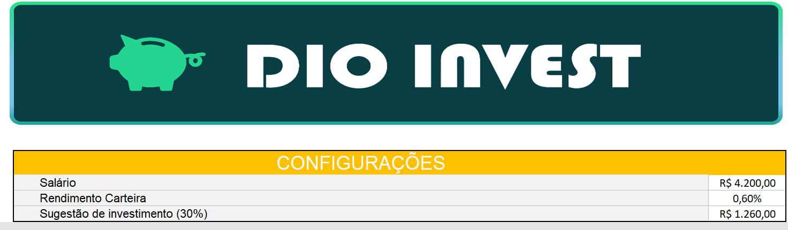
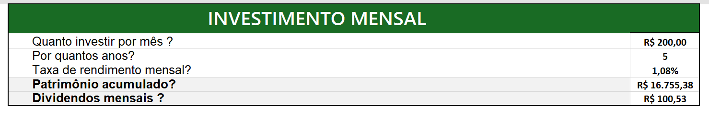
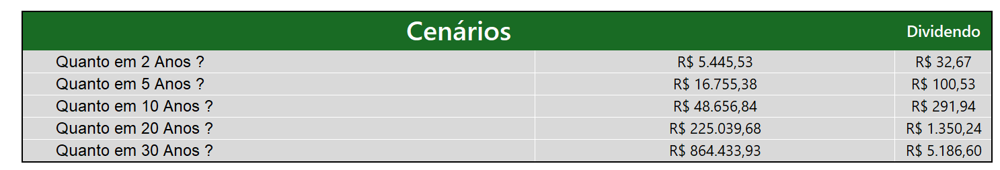
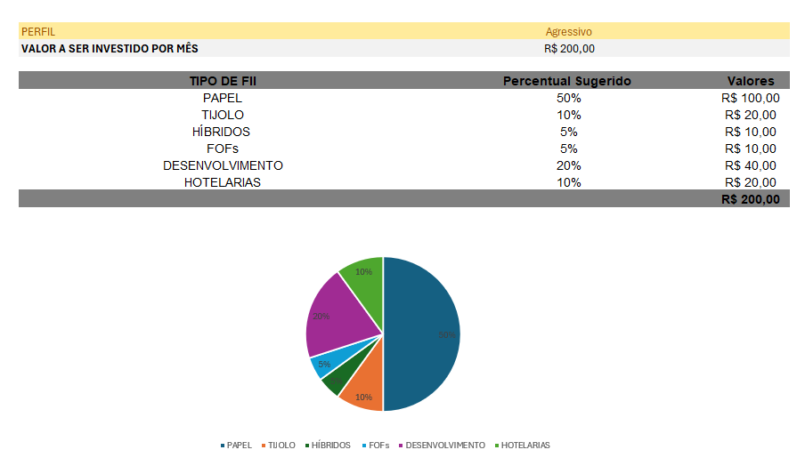
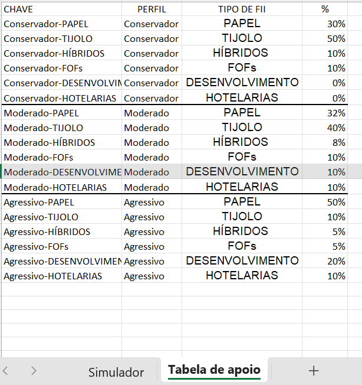

# Simulador de Investimentos em Fundos Imobiliários (FIIs)

Projeto desenvolvido para o desafio de código da **Digital Innovation One (DIO)**, com o objetivo de aplicar conceitos de Excel na construção de uma ferramenta prática de simulação de investimentos em Fundos de Investimento Imobiliário (FIIs).

## 📌 Sobre o desafio

Fundos Imobiliários são um tipo de investimento em que o cotista aplica recursos em empreendimentos do setor imobiliário (lajes corporativas, galpões logísticos, shoppings, papéis lastreados em imóveis, entre outros) e recebe rendimentos periódicos, geralmente mensais, isentos de Imposto de Renda para pessoa física em determinadas condições.

Investidores costumam ter dúvidas recorrentes na hora de planejar seus aportes:

- Quanto investir por mês?
- Por quanto tempo manter o investimento?
- Qual taxa de rendimento considerar?
- Quanto de patrimônio e dividendos esperar no futuro?

Este projeto propõe uma planilha que automatiza esses cálculos, permitindo simulações rápidas e ajudando na tomada de decisão.

## 📊 Estrutura da planilha

O arquivo [Simulador de investimentos fundos imobiliarios.xlsx](Simulador%20de%20investimentos%20fundos%20imobiliarios.xlsx) contém duas abas:

### Aba "Simulador"

**Configurações gerais**
- Salário
- Rendimento da carteira (%)
- Sugestão de investimento (30% do salário, usada como referência na planilha)



**Investimento mensal**
- Valor a investir por mês
- Prazo em anos
- Taxa de rendimento mensal, informada como percentual ao mês
- Patrimônio acumulado (calculado)
- Dividendos mensais estimados (calculados)



**Cenários de projeção**
- Simulação automática do patrimônio acumulado e dos dividendos mensais para 2, 5, 10, 20 e 30 anos, a partir do valor mensal investido e da taxa de rendimento definidos.

Os valores são projeções baseadas nos aportes e na taxa informados. Os rendimentos reais podem variar e não há garantia de rentabilidade.



**Perfil de investidor e alocação por tipo de FII**
- Definição do perfil (Conservador, Moderado ou Agressivo)
- Distribuição percentual sugerida entre os tipos de fundos: Papel, Tijolo, Híbridos, FoFs, Desenvolvimento e Hotelarias
- Cálculo automático do valor a alocar em cada categoria, de acordo com o valor mensal definido



### Aba "Tabela de apoio"

Tabela de referência com os percentuais de alocação recomendados para cada combinação de perfil (Conservador / Moderado / Agressivo) e tipo de FII, utilizada pelas fórmulas da aba principal para ajustar a sugestão de carteira automaticamente conforme o perfil escolhido.



## 🧮 Conceitos e funções aplicados

- Fórmulas financeiras para cálculo de juros compostos aplicados a aportes mensais
- Cálculo de dividendos mensais estimados a partir da taxa de rendimento informada
- Uso de tabelas de referência e busca de valores (`PROCV`/`ÍNDICE`+`CORRESP`) para vincular perfil de investidor à alocação sugerida
- Cenários comparativos de curto, médio e longo prazo
- Boas práticas de organização e formatação de planilhas financeiras

## 🎯 Objetivos de aprendizagem

- Criar ferramentas de simulação de investimentos em Excel
- Aplicar cálculos financeiros como rendimento mensal e cálculo de dividendos
- Documentar processos técnicos de forma clara e estruturada
- Utilizar o GitHub como ferramenta para compartilhamento de documentação técnica

## 📁 Estrutura do repositório

```
├── Simulador de investimentos fundos imobiliarios.xlsx   # Planilha do simulador
├── images/
│   ├── simulador-configuracoes.png                        # Print das Configurações Gerais
│   ├── investimento-mensal.png                             # Print da seção Investimento Mensal
│   ├── simulador-cenarios.png                              # Print dos Cenários de Projeção
│   ├── simulador-perfil-investidor.png                     # Print da seção Perfil de Investidor
│   └── tabela-apoio.png                                    # Print da aba Tabela de apoio
└── README.md                                               # Este documento
```

## 🚀 Como usar

1. Baixe o arquivo [Simulador de investimentos fundos imobiliarios.xlsx](Simulador%20de%20investimentos%20fundos%20imobiliarios.xlsx)
2. Abra no Excel (ou Google Sheets)
3. Preencha o valor mensal, o prazo em anos, a taxa de rendimento mensal (em percentual ao mês) e o perfil de investidor
4. Confira os resultados calculados automaticamente: patrimônio acumulado, dividendos mensais e cenários de 2 a 30 anos

> Os resultados são apenas estimativas e não constituem recomendação de investimento. A isenção de Imposto de Renda para pessoa física depende das condições previstas na legislação vigente.

## 📝 Experiência com o desafio

As fórmulas utilizadas na planilha envolveram conceitos básicos, já conhecidos anteriormente. O principal desafio — e também o maior aprendizado — foi a organização e a criação do layout visual: estruturar as informações de forma que o leitor consiga compreender o projeto de maneira clara, organizada e compacta, mesmo sem um conhecimento prévio detalhado sobre fundos imobiliários.

## 🔗 Referências

- [Documentação do GitHub](https://docs.github.com/)
- [GitHub Markdown Guide](https://docs.github.com/pt/get-started/writing-on-github/getting-started-with-writing-and-formatting-on-github/basic-writing-and-formatting-syntax)
- Trilha de estudos DIO — Excel para Fundos Imobiliários

---

Projeto desenvolvido por **Carlos Henrique Diniz Vieira** como parte da trilha de estudos da DIO.
